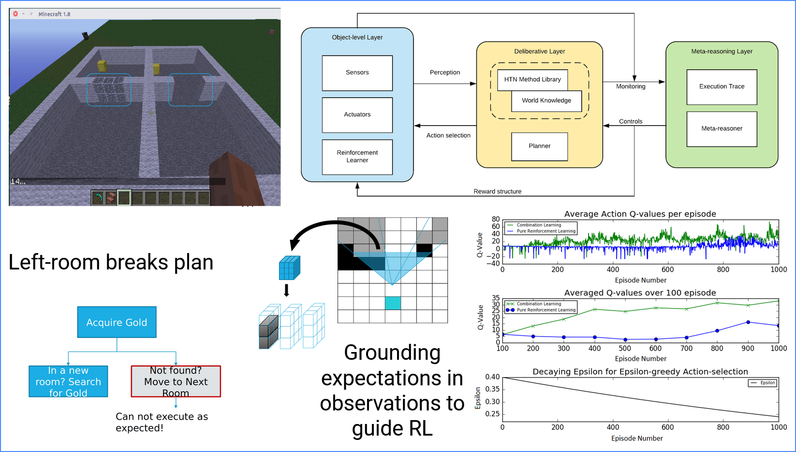

- [Research In-Progress](#research-in-progress)
  - [Guided learning in Assembly Domain using Prior Knowledge](#guided-learning-in-assembly-domain-using-prior-knowledge)
- [Past Research](#past-research)
  - [Guided learning in Simulation: Minecraft and Gazebo](#guided-learning-in-simulation-minecraft-and-gazebo)
  - [Learning from Driving Demonstrations](#learning-from-driving-demonstrations)
  - [Designing a Taxonomy for Modes of Human-robot Interaction](#designing-a-taxonomy-for-modes-of-human-robot-interaction)
- [Technical Projects](#technical-projects)
  - [Assembly Challenge @ World Robot Summit 2020](#assembly-challenge--world-robot-summit-2020)
  - [RoboCup At Home 2017](#robocup-at-home-2017)
  - [Exploring Human-aware Navigation](#exploring-human-aware-navigation)

## Research In-Progress

### Guided learning in Assembly Domain using Prior Knowledge

Given a prior task model and demonstration of its execution, how may a
manipulator robot monitors its progress and localize failure in semi-structured
conditions? Our research is trying to answer this question by applying
meta-reasoning framework on the assembly domain. Given a discrete space of
positions and orientations there are countably finite configurations possible
between two objects however it is not reasonable to learn over this entire space
in case a failure occurs, specially in semi-structured environments.
Meta-reasoning asks the question: given my previous experiences which state and
related sub-task have the highest probability of triggering this failure? By
answering this question we may guide a robot learner for more efficient learning
by either restricting the state-space or injecting shaped rewards.

[comment]: # [more...]({%link {{site.baseurl}}/projects/learning_assembly_prior_knowledge.md})

## Past Research

### Guided learning in Simulation: Minecraft and Gazebo

Our pilot study which builds the base for subsequent research. We wanted to
study if action-plans for given tasks can be grounded in observational
descriptions of the world rather than only symbolic descriptions. We used the world
of Minecraft for our simulated experiment so that actions are deterministic but
we used a LIDAR-like sensor on the agent to observe the world and use occupancy
grid as a descriptor. Our research question was: given a task model and its
execution under nominal conditions (grounded in observations and symbolic
descriptors) can the agent learn a variation of that plan in a slightly
different environment (semi-structurednedd)? We also present our results on a
simulated manipulator in Gazebo [read more...]({%link
{{site.baseurl}}/projects/minecraft_gazebo.md})

### Learning from Driving Demonstrations

### Designing a Taxonomy for Modes of Human-robot Interaction

## Technical Projects

### Assembly Challenge @ World Robot Summit 2020

### RoboCup At Home 2017

### Exploring Human-aware Navigation
